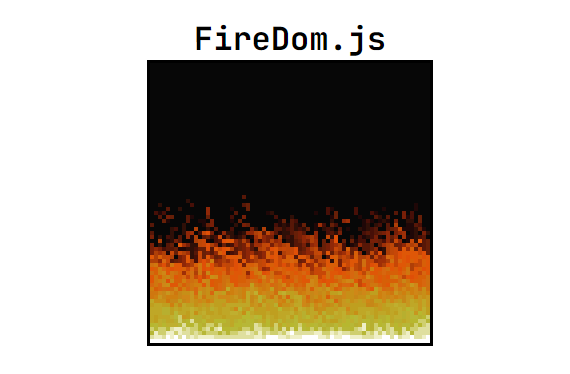

# FireDom.js

This project consists of a simple fire animation implemented in JavaScript.

## How it works

The animation is created using an array of pixels that represent the intensity of the fire in different parts of the screen. Fire spreads according to some rules defined in the code.

## Instructions for Execution

Open the link located in the descriptions.

## Technologies Used

- JavaScript
- HTML
- CSS

## Author

[ @Isaac20042012](https://github.com/Isaac20042012)
